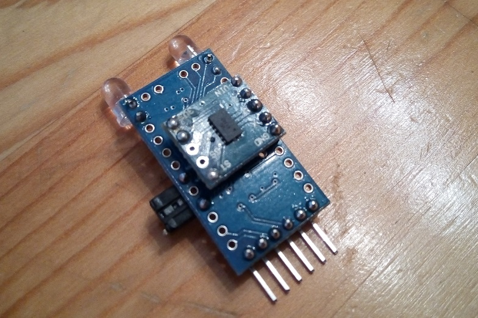

The goal of this project is to design a multipurpose portable light with different modes of operation. Current modes are: continuous, 1Hz beacon and strobe.

The prototype hardware can be seen below. There are currently just two LEDs, one red and one white. The control interface is made up of a button and an accelerometer.

